# CENTRO UNIVERSITÁRIO DE BRASÍLIA - CEUB
## CURSO DE CIÊNCIA DA COMPUTAÇÃO

---

# ECOTRACK WERT

**PROJETO INTEGRADOR II — ARTEFATO 3**  
**Gestão do Produto**  
**Professora Orientadora:** Adriana Falcomer Pontes  
**Local:** Brasília / DF  

### Autores:

* **Lucas Gonçalves Balduino** — RA: 22409139
* **Artur Feitoza** — RA: 22401202
* **Davi Oliveira Maia** — RA: 22305561
* **Eduardo Martins**

Este documento é a entrega do **Artefato 3**. Não republica o Artefato 1 nem o Artefato 2: cobre só os itens novos de gestão do produto.

Fontes: Lean Inception (personas, jornada, funcionalidades F01–F21), Artefato 2 (RF/RNF, backlog, sprints) e a arquitetura prevista no Artefato 1.

---

## Sumário

- [1. Arquitetura da informação](#1-arquitetura-da-informação)
- [2. Design arquitetural](#2-design-arquitetural)
- [3. Testes de integração](#3-testes-de-integração)
- [4. Protótipo de baixo nível](#4-protótipo-de-baixo-nível)
- [5. Storyboard](#5-storyboard)

---

## 1. Arquitetura da informação

A arquitetura da informação descreve **como o usuário encontra e percorre o EcoTrack**: telas, menu e fluxos por persona. O canal é **web desktop** (navegador). Não há aplicativo nativo nem mapa.

### 1.1 Objetivos que a navegação precisa servir

| Objetivo | O que a informação precisa mostrar |
|---|---|
| O1 — Centralizar a operação | Usuários, agências, lotes, equipamentos e destinações no mesmo sistema |
| O2 — Rastreabilidade e conformidade | Caminho agência → lote → equipamento → destinação + PDF e dashboard |
| O3 — Planejamento das coletas | Rota, motorista atribuído e status de recolhimento, sem GPS |

### 1.2 Sitemap

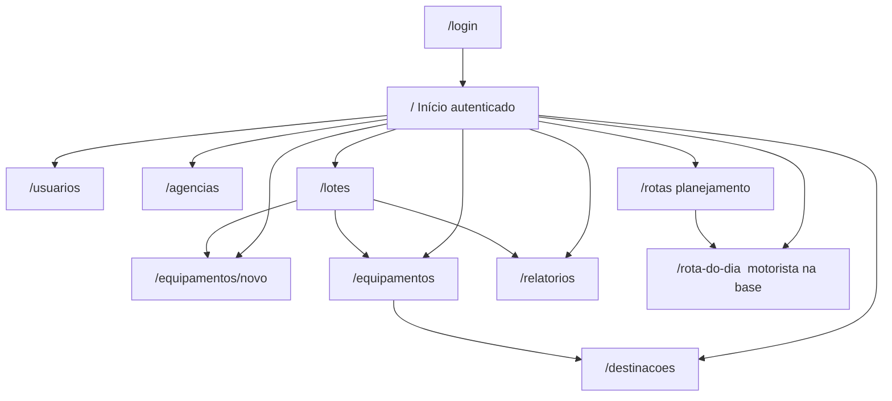

A home autenticada começa como área de trabalho (dashboard na sprint 5). Até lá, é um ponto de entrada para o menu.

### 1.3 Menu e visibilidade por perfil

O menu lateral é o índice permanente. Depois da sprint 6, cada perfil **só vê o que pode operar** (RF04–RF07).

| Item do menu | Rota | Admin | Gestor | Técnico | Auditor | Motorista |
|---|---|---|---|---|---|---|
| Início / Dashboard | `/` | sim | sim | sim | sim | não |
| Usuários | `/usuarios` | sim | não | não | não | não |
| Agências | `/agencias` | sim | sim | consulta | consulta | não |
| Lotes | `/lotes` | sim | sim | sim | consulta | não |
| Equipamentos | `/equipamentos`, `/equipamentos/novo` | sim | consulta | sim | consulta | não |
| Destinação | `/destinacoes` | sim | consulta | sim | consulta | não |
| Relatórios | `/relatorios` | sim | sim | consulta | sim | não |
| Rotas | `/rotas` | sim | sim | não | consulta | não |
| Rota do dia | `/rota-do-dia` | não | não | não | não | sim |

O auditor consulta e baixa PDF; não cria lote, equipamento nem destinação. O motorista vê só a rota a ele atribuída e registra recolhimento.

### 1.4 Fluxos por persona

| Persona | Papel | Caminho principal |
|---|---|---|
| **Renata** | Administradora | Login → Usuários (criar/editar/desativar, perfil) |
| **Marcos** | Gestor | Login → Dashboard → Agências / Lotes → Rotas (montar + atribuir motorista) → ver recolhimento |
| **Paulo** | Motorista | Login (na base) → Rota do dia → marcar recolhido / não / parcial |
| **Camila** | Técnica de triagem | Login → Lotes (status em triagem) → cadastrar/listar equipamentos → Destinação → concluir lote |
| **Helena** | Auditora | Login → Lotes / Equipamentos / Destinações (consulta) → Relatórios (gerar e baixar PDF) |

### 1.5 Vocabulário da interface

Os rótulos das telas usam os mesmos termos do backlog, para o usuário não traduzir jargão interno.

| Na tela | Significa |
|---|---|
| Agência | Ponto de coleta (código, cidade, UF) |
| Lote | Coleta ligada a uma agência (`pendente`, `em_triagem`, `concluido`) |
| Equipamento | Item do lote (tipo, marca, modelo, série, estado) |
| Destinação | Reciclagem, reúso ou destruição, com empresa e data |
| Rota | Lista ordenada de paradas + data + motorista |
| Recolhimento | `recolhido`, `nao_recolhido` ou `parcial` |

---

## 2. Design arquitetural

O EcoTrack é uma aplicação **em camadas**: interface web, API REST e banco relacional, empacotados com Docker. A escolha de stack é a do Artefato 1.

### 2.1 Visão em camadas

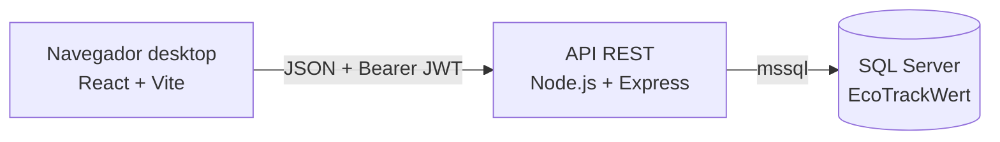

| Camada | Tecnologia | Responsabilidade |
|---|---|---|
| Front-end | React.js, JavaScript, CSS | Telas desktop, sessão, consumo da API |
| Back-end | Node.js, Express.js | Regras de negócio, autenticação, PDF |
| Persistência | SQL Server | Entidades e histórico (criação/atualização) |
| Ambiente | Docker Compose, Git/GitHub | Subir frontend, API e banco juntos |

Autenticação: senha com **bcrypt**; sessão com **JWT** (RNF02, RNF03). Relatórios em **PDFKit** (RNF08). Sem GPS, sem app nativo (RNF09).

### 2.2 Componentes da API

| Grupo | Rotas (visão) | Sprint em que entra |
|---|---|---|
| Saúde | `GET /health` | esqueleto |
| Autenticação | `POST /auth/login` | 1 |
| Agências | `GET/POST/PUT/DELETE /agencias` | 1 |
| Usuários | CRUD `/usuarios` | 2 |
| Lotes | CRUD `/lotes`; `PATCH .../status` na sprint 3 | 2–3 |
| Equipamentos | `GET/POST /equipamentos`; `PUT` na sprint 9 | 3 e 9 |
| Destinação | CRUD `/destinacoes` | 4 |
| Relatórios | `POST /relatorios/gerar`; `GET /relatorios` | 4–5 |
| Dashboard | `GET /dashboard` | 5 |
| Rotas / recolhimento | CRUD rota, atribuição, status de parada | 7–8 |

Todas as rotas de produto, **exceto** login e health, exigem `Authorization: Bearer`.

### 2.3 Modelo de dados (visão)

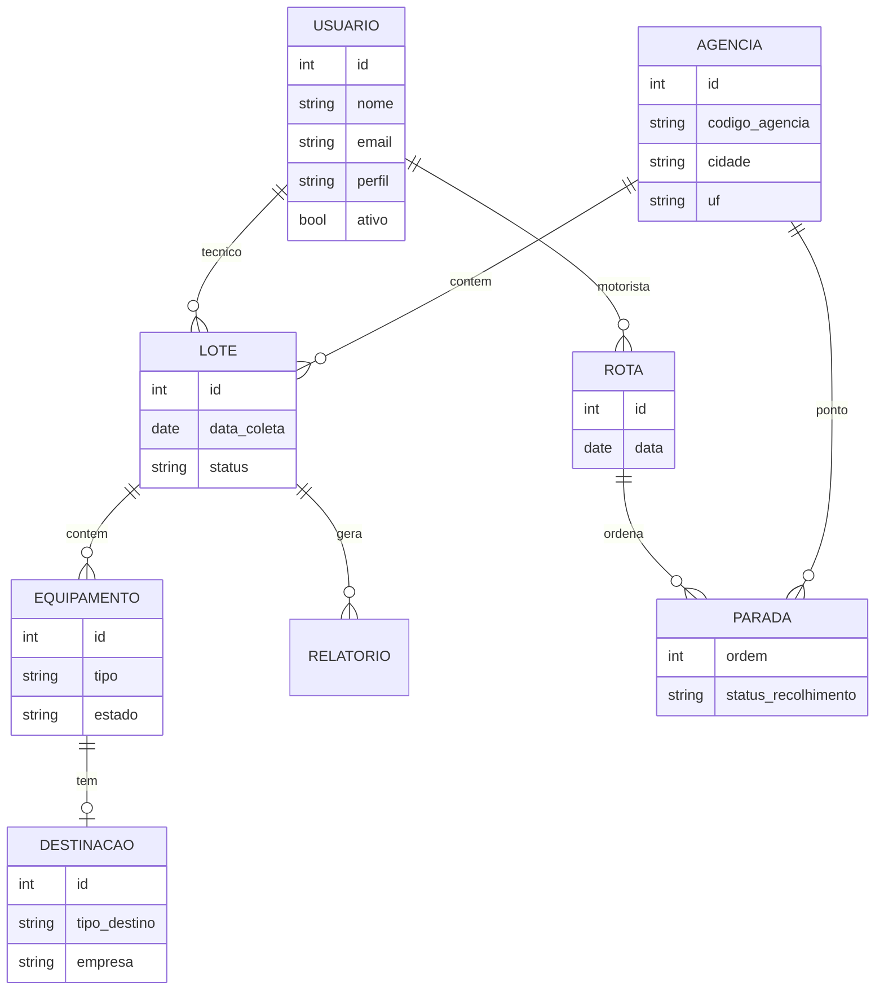

Perfis no cadastro: administrador, gestor, técnico, auditor e (a partir da sprint 6) motorista. Lote só vai a `concluido` se todo equipamento tiver destinação (RF16).

### 2.4 Sequência — login até uma operação protegida

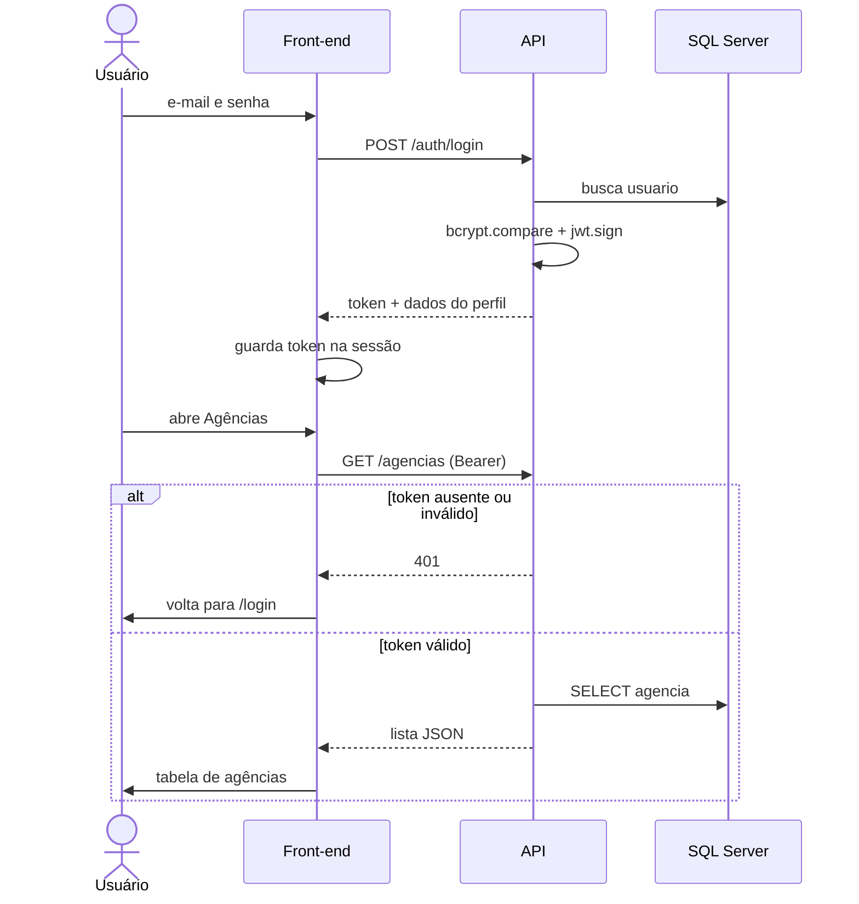

### 2.5 Implantação local

Docker Compose sobe três serviços: banco, API e front. O front chama a API por URL configurável (`VITE_API_URL`). Isso cobre RNF07 e RNF12 e permite o grupo validar os testes da seção 3 no mesmo ambiente.

---

## 3. Testes de integração

Os testes abaixo verificam o **encaixe entre tela, API e banco**, não um botão isolado. São casos manuais (pré-condição, passos, resultado). Ainda não há suíte automatizada neste artefato.

Legenda: **P** = passou / **F** = falhou / **N/A** = ainda fora da sprint em execução. A coluna Situação fica em branco na entrega e é preenchida na execução.

### 3.1 Autenticação e sessão

| ID | Caso | RF / RNF | Pré-condição | Passos | Resultado esperado |
|---|---|---|---|---|---|
| TI01 | Login válido | RF01, RNF02 | Seed `admin@wert.com.br` existe | POST `/auth/login` com e-mail e senha corretos | 200, corpo com `token` e `usuario` |
| TI02 | Login inválido | RF01 | — | POST com senha errada | 401, sem token |
| TI03 | Login incompleto | RF01 | — | POST sem senha | 400 |
| TI04 | API sem token | RNF03 | API no ar | GET `/agencias` sem `Authorization` | 401 |
| TI05 | Sessão no browser | RF01 | TI01 ok | Abrir `/login`, entrar, recarregar a página | Permanece autenticado; sem sessão cai em `/login` |

### 3.2 Agências e usuários

| ID | Caso | RF / RNF | Pré-condição | Passos | Resultado esperado |
|---|---|---|---|---|---|
| TI06 | CRUD de agência | RF08 | Usuário autenticado | Criar, listar, editar e excluir agência (API e tela) | Registro persiste; código duplicado é recusado |
| TI07 | CRUD de usuário | RF02, RF03, RF05 | Perfil administrador | Cadastrar usuário com perfil válido; desativar | Lista atualiza; inativo não autentica (403) |

### 3.3 Lote, equipamento e destinação

| ID | Caso | RF / RNF | Pré-condição | Passos | Resultado esperado |
|---|---|---|---|---|---|
| TI08 | Lote ligado à agência | RF09, RF10 | Agência e técnico existem | POST lote; mudar status `pendente` → `em_triagem` | Status gravado |
| TI09 | Cadastrar e listar equipamento | RF11–RF13 | Lote em triagem | POST equipamento; GET do lote | Item aparece na listagem |
| TI10 | Destinação e conclusão | RF15, RF16 | Equipamento no lote | Registrar destinação; tentar `concluido` sem destinação; depois com destinação | Sem destinação a API recusa `concluido`; com destinação aceita |

### 3.4 Conformidade e indicadores

| ID | Caso | RF / RNF | Pré-condição | Passos | Resultado esperado |
|---|---|---|---|---|---|
| TI11 | Gerar PDF | RF18, RNF08 | Lote com destinações | POST gerar relatório | Arquivo PDF armazenado |
| TI12 | Listar e baixar PDF | RF19 | TI11 ok | GET lista; download | Arquivo reabre |
| TI13 | Dashboard | RF17 | Há lotes e destinações | GET `/dashboard` e abrir `/` | Totais e quebras batem com o banco |
| TI14 | PDF com rota e motorista | RF20 | Rota atribuída existe | Gerar PDF do lote da rota | PDF cita motorista e rota |

### 3.5 Logística (sem GPS)

| ID | Caso | RF / RNF | Pré-condição | Passos | Resultado esperado |
|---|---|---|---|---|---|
| TI15 | Montar rota e atribuir | RF21, RF22, RNF09 | Agências e motorista cadastrados | Criar rota com paradas e ordem; atribuir motorista na mão | Rota gravada; **não** há cálculo automático nem mapa |
| TI16 | Rota do dia | RF07, RF23 | TI15 ok; login do motorista | Abrir `/rota-do-dia` | Só a rota daquele usuário |
| TI17 | Status de recolhimento | RF24, RF25 | TI16 ok | Marcar `recolhido`; gestor consulta | Gestor vê a coleta feita no sistema |

### 3.6 Perfil (a partir da sprint 6)

| ID | Caso | RF / RNF | Pré-condição | Passos | Resultado esperado |
|---|---|---|---|---|---|
| TI18 | Auditor não altera operação | RF06, RNF04 | Usuário auditor | Tentar POST de lote ou destinação | API recusa; menu sem ações de cadastro |
| TI19 | Motorista não vê agências | RF07 | Usuário motorista | Abrir o sistema após login | Menu só com rota do dia |

Os casos TI01–TI06 correspondem à sprint 1; os demais entram na sprint em que a feature for desenvolvida. Ambiente: Docker Compose (RNF07).

---

## 4. Protótipo de baixo nível

Wireframes de baixa fidelidade (caixa, rótulo e placeholder), **sem cor final**. O visual de entrega ainda copia o CSS da Wert (fundo claro, acento verde, sidebar + header), descrito no design system do projeto.

Convenção gráfica: fundo branco, traço preto, retângulo com **X** no lugar de imagem ou gráfico, linhas horizontais no lugar de texto corrido, botão em pílula ou caixa.

Arquivos em [`imagens/`](imagens/).

### 4.1 Login — `/login`

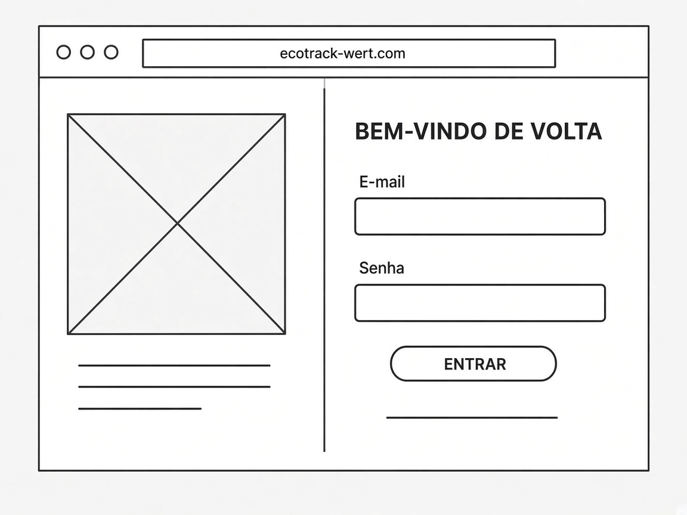

*Figura 4.1 — Login. Painel esquerdo: marca (placeholder). Painel direito: e-mail, senha e Entrar.*

Campos obrigatórios. Sucesso grava a sessão e vai para `/`. Erro: mensagem acima do botão.

### 4.2 Casca autenticada (sidebar + header)

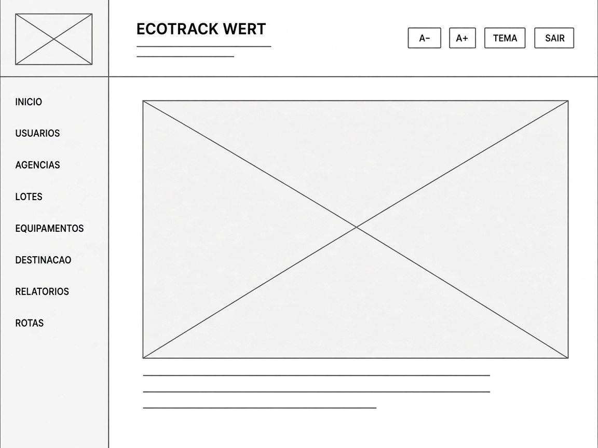

*Figura 4.2 — Casca após o login: menu à esquerda, título e ações (A−, A+, tema, Sair) no topo, conteúdo da rota no centro.*

Itens do menu seguem a tabela da seção 1.3. O motorista não vê esta casca completa: só a rota do dia.

### 4.3 Agências — `/agencias`

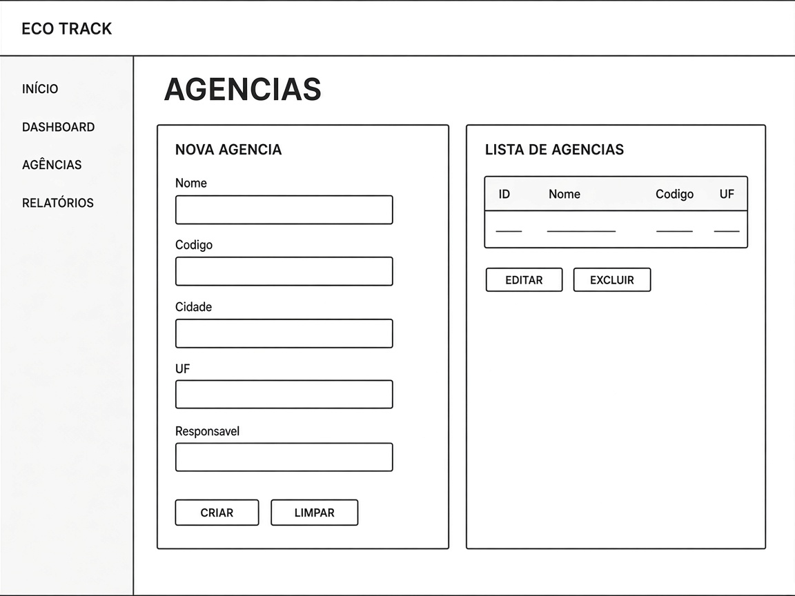

*Figura 4.3 — Formulário de nova agência à esquerda e listagem (ID, nome, código, UF) à direita, com Editar e Excluir.*

### 4.4 Lotes — `/lotes`

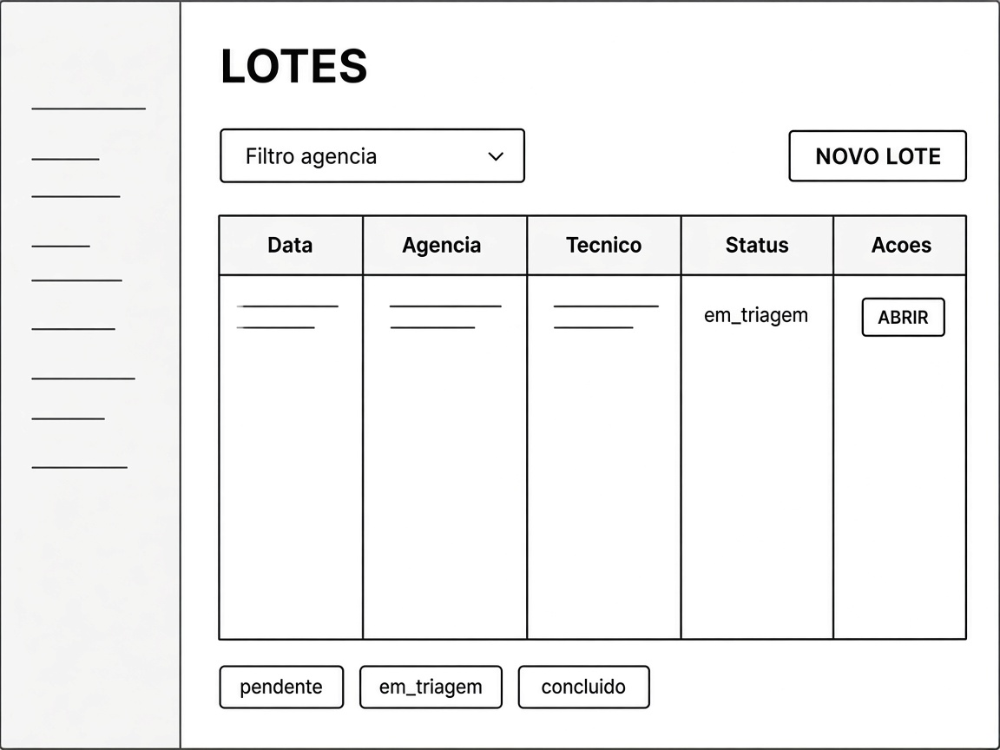

*Figura 4.4 — Filtro por agência, Novo lote e tabela (data, agência, técnico, status, Abrir). Status visíveis: pendente, em_triagem, concluido.*

Conclusão bloqueada se faltar destinação (mensagem de erro, não só o botão sumir).

### 4.5 Equipamentos — cadastro e lista

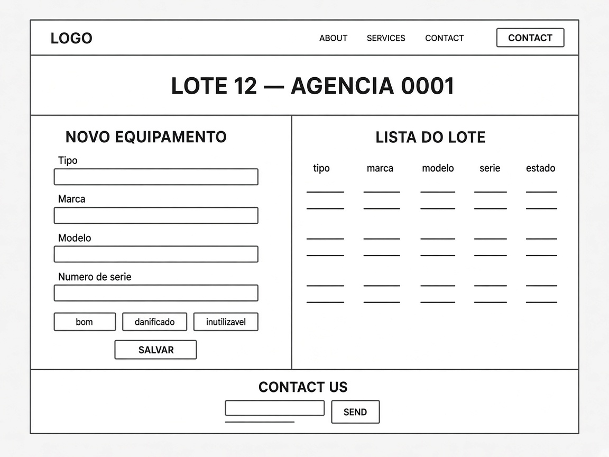

*Figura 4.5 — Lote aberto: cadastro (tipo, marca, modelo, série, estado) e lista do lote.*

Poucos campos obrigatórios além dos já definidos (RNF10). Série pode ser vazia.

### 4.6 Destinação

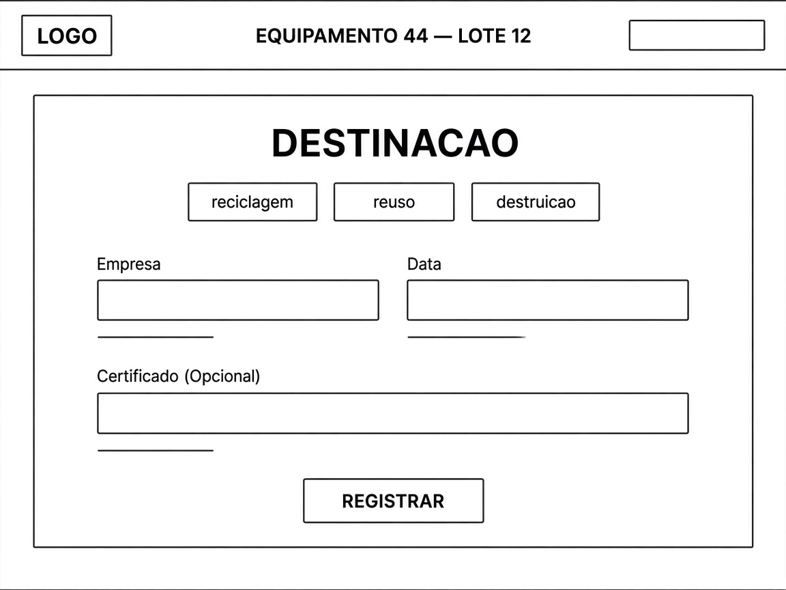

*Figura 4.6 — Uma destinação por equipamento: reciclagem, reúso ou destruição; empresa; data; certificado opcional.*

### 4.7 Dashboard — `/`

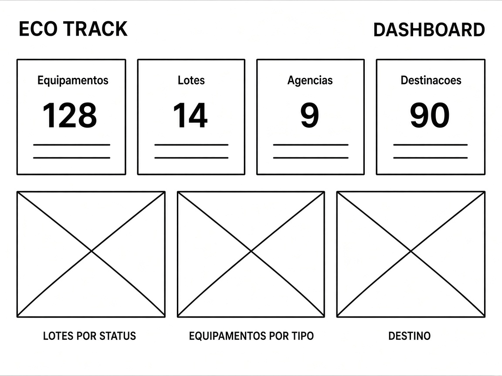

*Figura 4.7 — Totais (equipamentos, lotes, agências, destinações) e três placeholders de gráfico (status, tipo, destino).*

### 4.8 Planejamento de rota (Marcos) e rota do dia (Paulo)

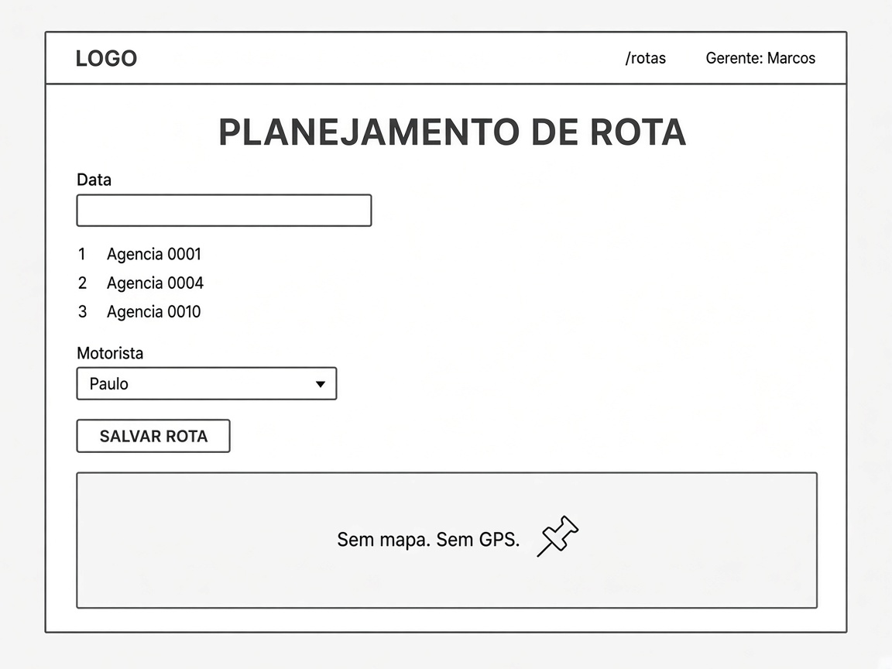

*Figura 4.8a — `/rotas` (Marcos): data, paradas em ordem, motorista escolhido à mão, Salvar rota. Sem mapa e sem GPS.*

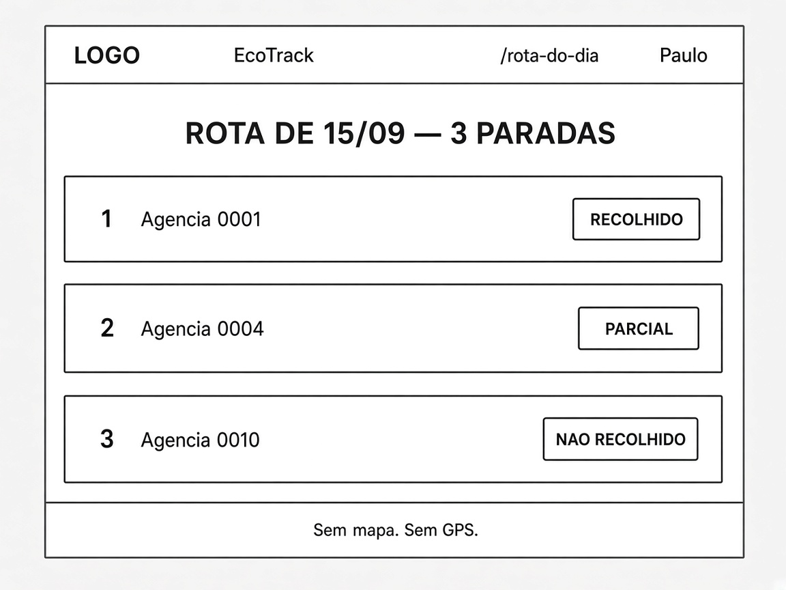

*Figura 4.8b — `/rota-do-dia` (Paulo): lista de paradas com status recolhido, parcial ou não recolhido. Sem mapa e sem GPS.*

Atribuição **manual**. O motorista não monta rota; só consulta e marca status.

### 4.9 Relatórios

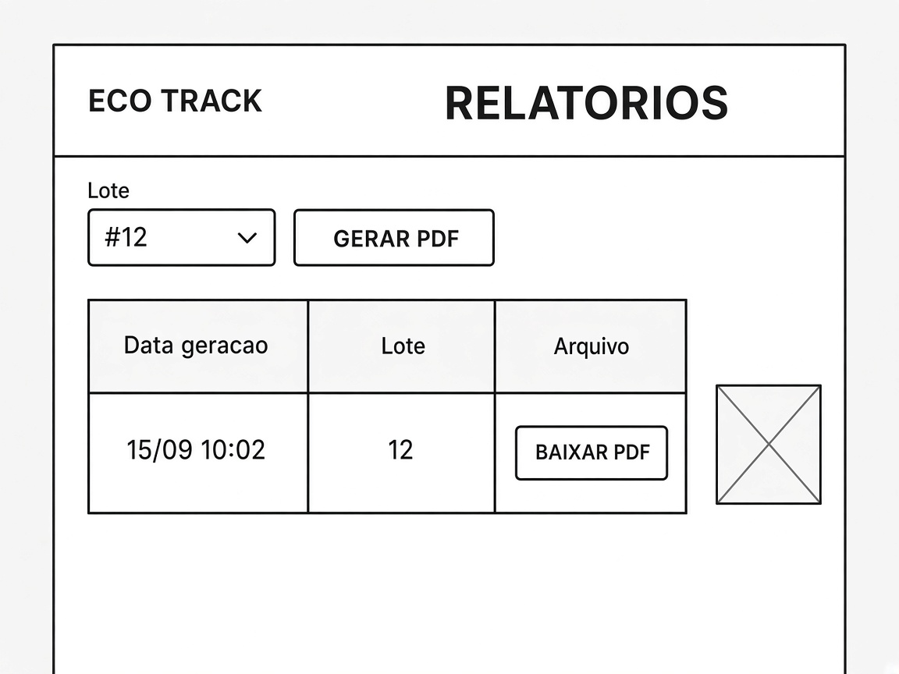

*Figura 4.9 — Escolha do lote, Gerar PDF e histórico com Baixar PDF.*

---

## 5. Storyboard

Jornada ponta a ponta da Lean Inception: **Marcos → Paulo → Camila → Helena**, com Renata na pré-condição. Cada quadro: quem, onde, o que faz, o que vê no EcoTrack.

### Quadro 1 — Renata libera as contas

| | |
|---|---|
| Persona | Renata (administradora), escritório da Wert |
| Ação | Cadastra Marcos, Paulo, Camila e Helena com perfil próprio |
| Tela | `/usuarios` |
| Fala | “Ninguém opera com login compartilhado.” |

### Quadro 2 — Marcos vê a semana

| | |
|---|---|
| Persona | Marcos (gestor), manhã no escritório |
| Ação | Abre o dashboard em vez de montar Excel |
| Tela | `/` com totais de lotes, equipamentos e destinações |
| Fala | “Onde está o gargalo desta semana?” |

### Quadro 3 — Marcos monta a rota e chama Paulo

| | |
|---|---|
| Persona | Marcos |
| Ação | Escolhe agências, ordena paradas, atribui Paulo **na mão** |
| Tela | `/rotas` |
| Fala | “A rota existe no sistema antes do caminhão sair.” |
| Fora | Sem GPS e sem algoritmo de atribuição |

### Quadro 4 — Paulo consulta na base

| | |
|---|---|
| Persona | Paulo (motorista), computador da base |
| Ação | Abre a rota do dia já atribuída |
| Tela | `/rota-do-dia` — lista curta de paradas |
| Fala | “É isto que eu faço hoje.” Sem papel, sem zap. |

### Quadro 5 — Paulo marca o recolhimento

| | |
|---|---|
| Persona | Paulo, de volta à base |
| Ação | Marca `recolhido`, `nao_recolhido` ou `parcial` |
| Tela | mesmos cartões da rota, um clique / poucos campos |
| Efeito | Marcos vê a coleta no sistema, não no WhatsApp |

### Quadro 6 — Camila confere o lote no galpão

| | |
|---|---|
| Persona | Camila (técnica), bancada |
| Ação | Localiza o lote, passa a `em_triagem`, lança cada equipamento |
| Tela | `/lotes` + `/equipamentos/novo` |
| Fala | “Se for rápido, eu não volto para o papel sujo.” |

### Quadro 7 — Camila fecha o ciclo ambiental

| | |
|---|---|
| Persona | Camila |
| Ação | Registra destinação; tenta concluir o lote |
| Tela | `/destinacoes` + status do lote |
| Regra | Lote **não** fica `concluido` com item sem destinação |

### Quadro 8 — Helena arquiva a evidência

| | |
|---|---|
| Persona | Helena (auditora) |
| Ação | Segue agência → lote → equipamentos → destinação; gera o PDF |
| Tela | consulta + `/relatorios` |
| Fala | “O fio está contínuo.” Não altera operação. |
| Depois das rotas | O PDF também traz motorista e paradas |

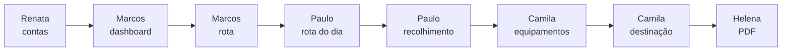

---

## Referências deste artefato

- Artefato 1 — proposta de solução e stack em camadas  
- Artefato 2 — RF01–RF25, RNF01–RNF12, backlog US01–US21, sprints 1–9  
- Lean Inception — personas, jornada ponta a ponta, F01–F21, escopo (sem GPS)
