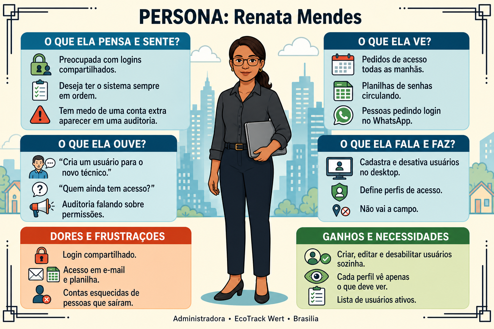
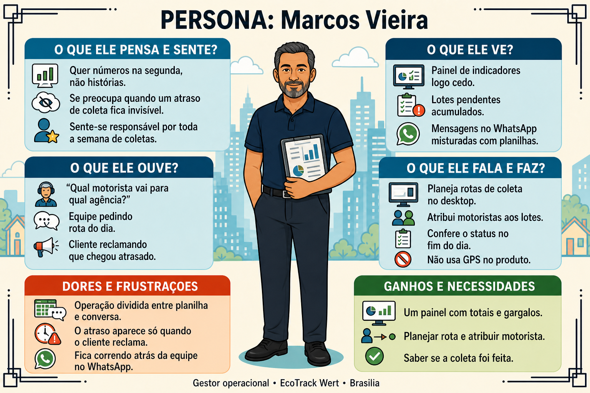
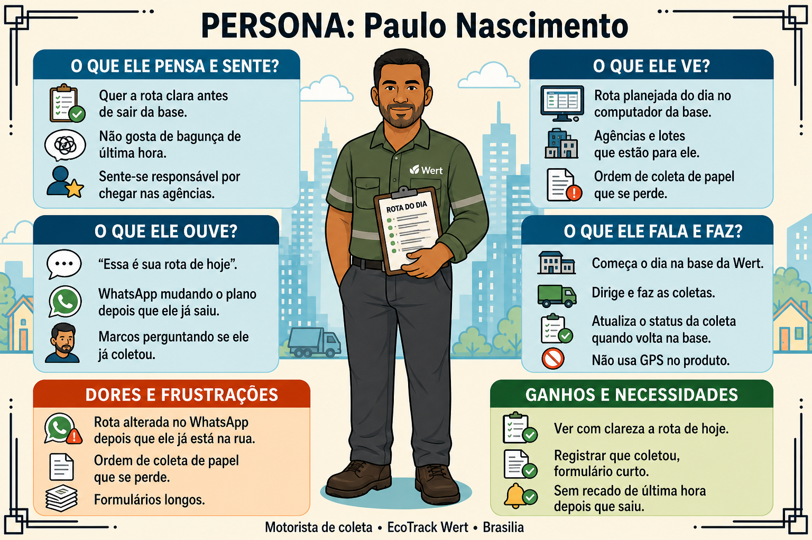
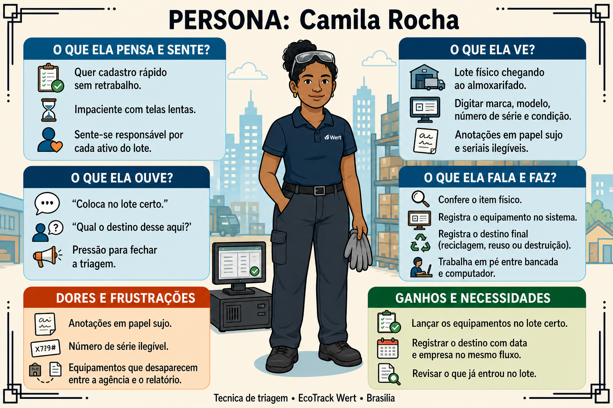
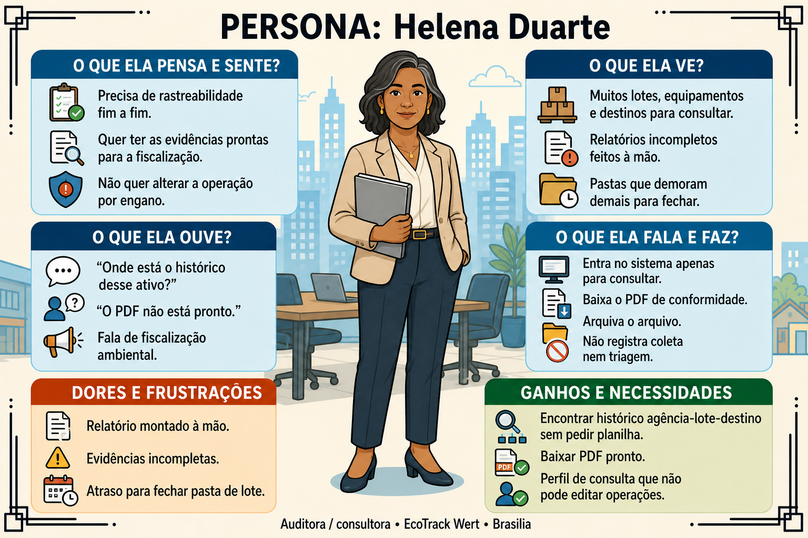

# Personas — EcoTrack Wert

| Campo | Valor |
|---|---|
| Etapa | 4 — Desenvolvimento de personas |
| Data desta versão | 19/08/2026 |
| Status | Validado na sessão (19/08/2026) — cinco fichas e cinco mapas ilustrados |
| Depende de | [Objetivos](../03-objetivos-do-produto/objetivos.md) |

Uma persona por perfil do produto. Mapas visuais (estilo ilustrado) em [imagens/](imagens/). Prompts: [prompts-imagens-personas.md](prompts-imagens-personas.md).

---

## Visão geral

| Apelido | Perfil no produto | Objetivo de negócio que mais atende |
|---|---|---|
| **Renata** | Administradora | 1 — Centralizar a operação (acessos e governança) |
| **Marcos** | Gestor operacional | 1 e 3 — Visão da operação + planejamento de coletas |
| **Paulo** | Motorista | 3 — Executar a rota planejada e registrar recolhimento |
| **Camila** | Técnica de triagem | 2 — Rastreabilidade do equipamento e destinação |
| **Helena** | Auditora / consultora | 2 — Conformidade e evidência em PDF |

---

## Persona 1 — Renata (administradora)

- **Apelido:** Renata
- **Nome:** Renata Mendes
- **Perfil:** 41 anos, administradora de sistemas da Wert em Brasília/DF. Renda mensal aproximada de R$ 11.000 a R$ 13.000. Responsável por usuários, perfis e pela “casa em ordem” da plataforma.
- **Comportamento:** Trabalha de segunda a sexta no escritório, sempre no computador. Começa o dia conferindo se alguém pediu acesso novo. Não vai a campo. Evita planilha de senha e login compartilhado. Fora do trabalho, lê notícias e organiza a rotina da casa; no sistema, prefere telas claras, com pouco ruído.
- **Necessidades:**
  - Cadastrar, editar e desativar usuários sem pedir ajuda técnica
  - Garantir que cada pessoa veja só o que o perfil permite (admin, gestor, técnico, auditor, motorista)
  - Saber quem está ativo, para não deixar conta de quem saiu da empresa aberta
  - **Dor:** controle de acesso solto (e-mail, zap, planilha) e medo de auditoria achar usuário indevido

---

## Persona 2 — Marcos (gestor operacional)

- **Apelido:** Marcos
- **Nome:** Marcos Vieira
- **Perfil:** 47 anos, gestor operacional da Wert. Renda mensal aproximada de R$ 13.000 a R$ 16.000. Planeja coletas, acompanha lotes e olha indicadores.
- **Comportamento:** Chega cedo, abre o dashboard antes das reuniões. Monta a semana de coletas: quais agências, qual motorista, qual lote. Cobra status no fim do dia. Usa o sistema no desktop do escritório; o celular é para falar com a equipe, não para GPS de rota. Fim de semana: família e churrasco; na segunda quer números, não narrativa.
- **Necessidades:**
  - Ver totais e gargalos (lotes pendentes, destinações, equipamentos por estado) num único painel
  - Planejar rotas de coleta e atribuir motorista a agências/lotes
  - Acompanhar se o recolhimento foi feito, sem perseguir a equipe no WhatsApp
  - **Dor:** operação espalhada em planilha + mensagens; atraso de coleta só aparece quando o cliente reclama

---

## Persona 3 — Paulo (motorista)

- **Apelido:** Paulo
- **Nome:** Paulo Nascimento
- **Perfil:** 36 anos, motorista de coleta da Wert. Renda mensal aproximada de R$ 4.000 a R$ 5.500. Executa as rotas definidas pelo gestor e registra o recolhimento.
- **Comportamento:** Começa o dia na **base** da Wert. Consulta no computador (ou com o Marcos) a rota do dia: agências e lotes atribuídos. Dirige o caminhão, recolhe nas agências e volta. **Não** usa GPS do EcoTrack nem app de atribuição automática: a rota já vem planejada. Atualiza o status de recolhimento quando tem acesso ao sistema na base (saída ou retorno). Fora do trabalho, joga futebol no fim de semana e evita burocracia.
- **Necessidades:**
  - Ver com clareza a rota do dia (pontos de coleta e o que levar)
  - Registrar que a coleta foi feita, sem preencher formulário longo
  - Não depender de recado de última hora no zap depois de já ter saído
  - **Dor:** rota mudada no informal depois que ele já está na rua; papel de ordem de coleta que se perde

---

## Persona 4 — Camila (técnica de triagem)

- **Apelido:** Camila
- **Nome:** Camila Rocha
- **Perfil:** 28 anos, técnica de triagem no galpão da Wert. Renda mensal aproximada de R$ 4.800 a R$ 6.000. Recebe o lote, confere o físico e cadastra cada equipamento e a destinação.
- **Comportamento:** Trabalho em pé, com EPI, entre bancada e computador do galpão. Precisa de cadastro rápido: tipo, marca, modelo, número de série, estado (bom / danificado / inutilizável). Depois registra destinação (reciclagem, reúso ou destruição) e empresa destinatária. Pouca paciência com tela lenta ou campo obrigatório demais. Fora do expediente, cursos técnicos e série no streaming.
- **Necessidades:**
  - Lançar equipamento no lote certo, sem retrabalho
  - Registrar destinação final com data e empresa, no mesmo fluxo
  - Conferir o que já entrou no lote antes de fechar a triagem
  - **Dor:** anotação em papel sujo, série ilegível, equipamento “sumido” entre a agência e o laudo

---

## Persona 5 — Helena (auditora / consultora)

- **Apelido:** Helena
- **Nome:** Helena Duarte
- **Perfil:** 52 anos, auditora e consultora ambiental. Atende a Wert em ciclos de verificação. Renda mensal aproximada de R$ 14.000 a R$ 18.000 (consultoria).
- **Comportamento:** Não opera coleta nem triagem. Entra no sistema para **consultar**: lote, equipamento, destinação, PDF. Precisa de rastreio ponta a ponta para parecer técnico ou fiscalização. Trabalha no notebook, em sala de reunião ou home office. Linguagem formal; imprime ou arquiva o PDF. Fora do trabalho, caminhadas e leitura.
- **Necessidades:**
  - Encontrar o histórico de um ativo (agência → lote → destinação) sem pedir planilha ao gestor
  - Baixar relatório de conformidade em PDF, pronto para arquivo
  - Acessar com perfil de consulta, sem risco de alterar operação
  - **Dor:** laudo montado à mão, evidência incompleta, demora para “fechar” a pasta de um lote

---

## Relação com o EcoTrack

| Persona | O que faz no sistema | O que não faz |
|---|---|---|
| Renata | Usuários, perfis, status ativo/inativo | Operar lote em campo |
| Marcos | Dashboard, agências, lotes, planejar rota, atribuir motorista | Triagem física de cada peça |
| Paulo | Consultar rota atribuída; atualizar status de recolhimento | Definir a rota; usar GPS do produto |
| Camila | Equipamentos e destinação | Autorizar usuários; emitir estratégia logística |
| Helena | Consultar rastreio e gerar/baixar PDF | Cadastrar coleta ou alterar destinação no dia a dia |

---

## Histórico

| Data | O quê |
|---|---|
| 19/08/2026 | Cinco personas redigidas (um perfil cada), alinhadas à visão, ao escopo e aos três objetivos. |
| 19/08/2026 | Mapa ilustrado da Renata aceito e anexado. |
| 19/08/2026 | Mapa ilustrado do Marcos aceito e anexado. |
| 19/08/2026 | Mapa ilustrado do Paulo aceito e anexado. |
| 19/08/2026 | Mapa ilustrado da Camila aceito e anexado. |
| 19/08/2026 | Mapa ilustrado da Helena aceito e anexado. Cinco mapas completos. |
