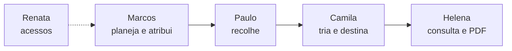

# Jornada do usuário — coleta até conformidade

| Campo | Valor |
|---|---|
| Etapa | 5 — Jornada do usuário |
| Data desta versão | 19/08/2026 |
| Status | Validado na sessão (19/08/2026) |
| Depende de | [Personas](../04-personas/personas.md) |

---

## Recorte desta jornada

- **Tipo:** jornada **ponta a ponta** do produto (não uma persona isolada)
- **Personas em sequência:** Marcos → Paulo → Camila → Helena
- **Pré-condição:** Renata já cadastrou os usuários e perfis (admin, gestor, técnico, motorista, auditor). Ela não opera esta jornada.
- **Objetivo do processo:** planejar a coleta, executar o recolhimento, triar os equipamentos, registrar a destinação e deixar evidência auditável em PDF
- **Processo:** da semana de coletas no escritório da Wert até o arquivo de conformidade da auditora

Fora desta jornada (escopo do produto): GPS, atribuição automática de rota, app nativo.

---

## Visão das quatro fases

| Fase | Persona | Objetivo dela aqui | Canal principal |
|---|---|---|---|
| 0. Acesso | Renata | Contas e perfis prontos | Web desktop |
| 1. Planejamento | Marcos | Semana de coletas visível e atribuída | Web desktop |
| 2. Recolhimento | Paulo | Rota do dia clara e status registrado | Base (web) + campo físico |
| 3. Triagem | Camila | Lote conferido, equipamento e destinação no sistema | Galpão (web + físico) |
| 4. Conformidade | Helena | Histórico ponta a ponta e PDF arquivado | Web desktop |

---

## Passos

### Fase 0 — Pré-condição (Renata)

| # | Passo | Ponto de contato | Emoção | Pensamento / oportunidade |
|---|---|---|---|---|
| 0.1 | Cadastra ou desativa usuários (Marcos, Paulo, Camila, Helena) e define o perfil de cada um | Web — tela de usuários | Tranquila se a lista está certa; tensa se ainda existe login compartilhado | “Ninguém opera sem conta própria.” Oportunidade: perfil de **motorista**; desativar quem saiu; autorização de fato por perfil (não só o campo no cadastro) |

---

### Fase 1 — Planejamento (Marcos)

| # | Passo | Ponto de contato | Emoção | Pensamento / oportunidade |
|---|---|---|---|---|
| 1.1 | Abre o dashboard no início do dia | Web — dashboard | Satisfeito se há números; frustrado se precisa montar resumo no Excel | “Onde estão os gargalos desta semana?” Indicadores de lotes, equipamentos, destinações e status |
| 1.2 | Confere agências que precisam de coleta e abre ou seleciona o lote | Web — agências e lotes | Satisfeito se a agência já está cadastrada | Lote ligado à agência, data de coleta, técnico, status (`pendente` / `em_triagem` / `concluido`) |
| 1.3 | Monta a **rota da coleta**: pontos (agências/lotes) do dia ou da semana | Web — planejamento de rotas | Satisfeito se cabe numa tela; frustrado se ainda depende de planilha + zap | Oportunidade central da expansão: cadastrar rota, lista ordenada de paradas, sem GPS |
| 1.4 | **Atribui** Paulo (motorista) à rota / aos lotes | Web — atribuição | Satisfeito quando o nome aparece na rota | Atribuição **manual** (não automática). O lote tem técnico responsável; o motorista da coleta é outra atribuição |
| 1.5 | Comunica a rota pelo sistema (Paulo vê na base), não por recado tardio | Web | Aliviado se Paulo confirma no sistema | Oportunidade: rota visível para o motorista **antes** de sair; evita mudança informal depois que o caminhão saiu |

---

### Fase 2 — Recolhimento (Paulo)

| # | Passo | Ponto de contato | Emoção | Pensamento / oportunidade |
|---|---|---|---|---|
| 2.1 | Na **base**, abre a rota do dia (agências, lotes, o que recolher) | Web desktop na base | Satisfeito se está claro; frustrado se só existe papel | “É isto que eu faço hoje.” Tela simples: paradas + status. Sem mapa ao vivo |
| 2.2 | Dirige e recolhe nas agências | Campo físico (agência / caminhão) | Neutro no trânsito; tenso se a lista mudou depois da saída | Fora do sistema (sem GPS). O produto não acompanha o trajeto |
| 2.3 | Volta à base (ou usa o computador na saída/retorno) e marca o recolhimento | Web — status de recolhimento | Satisfeito se for um clique / poucos campos | Oportunidade: status curto (ex.: recolhido / não recolhido / parcial) no lote ou na parada da rota, sem formulário longo |
| 2.4 | Marcos vê no sistema que a coleta aconteceu | Web — lote / rota / dashboard | Marcos fica seguro; Paulo não é cobrado no WhatsApp | Oportunidade: o atraso deixa de aparecer só quando o cliente reclama |

---

### Fase 3 — Triagem (Camila)

| # | Passo | Ponto de contato | Emoção | Pensamento / oportunidade |
|---|---|---|---|---|
| 3.1 | Recebe o lote físico no galpão e localiza o mesmo lote no sistema | Físico + web — listagem de lotes | Satisfeita se o lote já existe e está “pendente” ou “em triagem” | Marcos (ou o fluxo) atualiza o lote para `em_triagem` |
| 3.2 | Confere cada peça na bancada e cadastra o equipamento no lote: tipo, marca, modelo, número de série, estado | Físico + web — cadastro de equipamentos | Satisfeita se for rápido; frustrada com papel sujo ou série ilegível | Cadastro no lote; série opcional; estado `bom` / `danificado` / `inutilizavel` |
| 3.3 | Lista o que já entrou no lote antes de fechar a conferência | Web — listagem de equipamentos | Satisfeita se bate com o físico | Evita equipamento “sumido” entre agência e laudo |
| 3.4 | Registra a destinação de cada item (reciclagem, reúso ou destruição), empresa e data | Web — destinação | Satisfeita se for no mesmo fluxo do equipamento | Uma destinação por equipamento; comprovante opcional |
| 3.5 | Encerra a triagem do lote (`concluido`) quando o físico e o sistema batem | Web — status do lote | Alívio ao fechar o lote | Oportunidade: não concluir lote com equipamento sem destinação (regra de consistência) |

---

### Fase 4 — Conformidade (Helena)

| # | Passo | Ponto de contato | Emoção | Pensamento / oportunidade |
|---|---|---|---|---|
| 4.1 | Entra com perfil de **auditora** (consulta) | Web — login | Tranquila se não consegue alterar operação | Oportunidade: autorização por perfil — Helena não cadastra lote nem destinação no dia a dia |
| 4.2 | Localiza o lote / o ativo: agência → lote → equipamentos → destinação | Web — lotes, equipamentos, destinações | Satisfeita se o fio é contínuo; frustrada se faltar um elo | Rastreabilidade ponta a ponta, objetivo 2 |
| 4.3 | Gera ou baixa o **relatório PDF** do lote | Web — relatórios | Satisfeita se o PDF traz técnico, agência, itens e destinação | Depois das rotas, o PDF também deve refletir motorista e paradas |
| 4.4 | Arquiva o PDF para o ciclo de verificação | Web + arquivo local/impresso | Segura para inspeção | Substitui o laudo montado à mão |

---

## O que esta jornada exige do produto

Lista de capacidades que a etapa 6 (brainstorm) deve cobrir. Marcação:

- **Núcleo** — rastreabilidade e operação básica (ondas 1–5)  
- **Complemento** — governança e consistência (onda 6)  
- **Expansão** — planejamento e atribuição de coletas (ondas 7–9)

| Capacidade | Origem |
|---|---|
| Login e cadastro de usuários / perfis | Núcleo + complemento (autorização por perfil; perfil motorista) |
| Dashboard gerencial | Núcleo |
| CRUD de agências | Núcleo |
| CRUD de lotes e status | Núcleo |
| Planejar rota de coleta (paradas, ordem, data) | Expansão |
| Atribuir motorista à rota/lote | Expansão |
| Motorista consultar a rota do dia na base | Expansão |
| Registrar status de recolhimento (simples) | Expansão |
| Gestor ver se a coleta foi feita | Expansão (+ dashboard) |
| Cadastrar e listar equipamentos no lote | Núcleo |
| Registrar destinação | Núcleo |
| Impedir lote concluído sem destinação | Complemento |
| Relatório PDF do lote | Núcleo |
| Auditor só consulta | Complemento |

---

## Fora da jornada (de propósito)

- Navegação GPS / mapa ao vivo no caminhão  
- Atribuição automática de motorista ou otimização de rota  
- App nativo do Paulo  
- Integração com sistemas do Banco do Brasil  

---

## Histórico

| Data | O quê |
|---|---|
| 19/08/2026 | Jornada ponta a ponta redigida (Marcos → Paulo → Camila → Helena), com Renata como pré-condição de acesso. |
