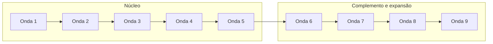

# Sequenciador de funcionalidades (ondas)

| Campo | Valor |
|---|---|
| Etapa | 9 — Priorização em ondas |
| Data desta versão | 20/08/2026 |
| Status | Validado na sessão (19/08/2026) |
| Depende de | [Pesos](../08-esforco-negocio-ux/pesos.md) e [Semáforo](../07-semaforo-tecnico-negocio/semaforo.md) |

---

## Regras de ouro (aplicadas)

1. No máximo **três** cartões por onda  
2. No máximo **um** vermelho (aqui: **zero**)  
3. Uma onda **não** tem três cartões só amarelos/vermelhos  
4. Soma de E ≤ **5** (E=1, EE=2, EEE=3)  
5. Soma de $ ≥ **4** e de ♥ ≥ **4**  
6. Origem em onda anterior. Exceção: na **mesma onda** só o que é um único módulo entregue em sequência (ex.: gerar PDF e listar PDF; montar rota e atribuir motorista)

---

## Corte MVP × incrementos

Todas as nove ondas serão desenvolvidas neste semestre (PI2).

| Bloco | Ondas | Sprints | Significado |
|---|---|---|---|
| **Núcleo** (MVP de rastreabilidade) | 1 a 5 | 1 a 5 | Login, cadastros, destinação, PDF, dashboard |
| **Complemento** (governança) | 6 | 6 | Perfil motorista, permissões, consistência do lote |
| **Expansão** (logística) | 7 a 9 | 7 a 9 | Rotas, atribuição, recolhimento, PDF completo |

GPS e atribuição automática ficam fora deste sequenciador (escopo da etapa 2).

---

## Onda 1 — Acesso e pontos de coleta

Sprint 1. **E 4 · $ 6 · ♥ 4** · 2 verdes.

| ID | Funcionalidade | Cor | E | $ | ♥ |
|---|---|---|---|---|---|
| F01 | Autenticar com e-mail e senha | Verde | EE | $$$ | ♥♥ |
| F05 | Cadastrar e manter agências | Verde | EE | $$$ | ♥♥ |

Por quê: dá para entrar no sistema e existir o lugar da coleta.

---

## Onda 2 — Usuários e lotes

Sprint 2. **E 4 · $ 6 · ♥ 5** · 2 verdes.

| ID | Funcionalidade | Cor | E | $ | ♥ |
|---|---|---|---|---|---|
| F02 | Cadastrar, editar e desativar usuários | Verde | EE | $$$ | ♥♥ |
| F06 | Cadastrar e manter lotes | Verde | EE | $$$ | ♥♥♥ |

Por quê: Renata governa contas; Marcos passa a ter o lote ligado à agência da onda 1.

---

## Onda 3 — Equipamentos e status do lote

Sprint 3. **E 4 · $ 7 · ♥ 7** · 3 verdes.

| ID | Funcionalidade | Cor | E | $ | ♥ |
|---|---|---|---|---|---|
| F07 | Atualizar status do lote | Verde | E | $$ | ♥♥ |
| F08 | Cadastrar equipamento no lote | Verde | EE | $$$ | ♥♥♥ |
| F09 | Listar equipamentos do lote | Verde | E | $$ | ♥♥ |

Por quê: Camila opera o lote da onda 2. Cadastro e listagem saem juntos (mesmo módulo).

---

## Onda 4 — Destinação e PDF

Sprint 4. **E 4 · $ 6 · ♥ 6** · 2 verdes.

| ID | Funcionalidade | Cor | E | $ | ♥ |
|---|---|---|---|---|---|
| F11 | Registrar destinação | Verde | EE | $$$ | ♥♥♥ |
| F14 | Gerar PDF de conformidade | Verde | EE | $$$ | ♥♥♥ |

Por quê: fecha o ciclo ambiental e a evidência da Helena. PDF depois do equipamento (onda 3).

---

## Onda 5 — Dashboard e arquivo de PDFs

Sprint 5. **E 3 · $ 5 · ♥ 5** · 2 verdes.

| ID | Funcionalidade | Cor | E | $ | ♥ |
|---|---|---|---|---|---|
| F13 | Dashboard de indicadores | Verde | EE | $$$ | ♥♥♥ |
| F15 | Listar e baixar PDFs | Verde | E | $$ | ♥♥ |

Por quê: Marcos vê números; Helena reabre laudos. F15 exige F14 (onda 4). Encerra o MVP de rastreabilidade.

---

## Onda 6 — Governança e consistência

Sprint 6. **E 4 · $ 7 · ♥ 6** · 2 verdes + 1 amarelo.

| ID | Funcionalidade | Cor | E | $ | ♥ |
|---|---|---|---|---|---|
| F03 | Incluir perfil motorista | Verde | E | $$ | ♥ |
| F04 | Restringir telas e APIs por perfil | Amarelo | EE | $$$ | ♥♥♥ |
| F12 | Não concluir lote sem destinação | Verde | E | $$ | ♥♥ |

Por quê: destrava a logística (motorista), atende Renata/Helena (permissões) e impede lote “fechado” oco. F03 depois de F02 (onda 2).

---

## Onda 7 — Planejar rota e atribuir motorista

Sprint 7. **E 5 · $ 6 · ♥ 6** · 2 amarelos.

| ID | Funcionalidade | Cor | E | $ | ♥ |
|---|---|---|---|---|---|
| F17 | Montar rota com paradas e ordem | Amarelo | EEE | $$$ | ♥♥♥ |
| F18 | Atribuir motorista à rota | Amarelo | EE | $$$ | ♥♥♥ |

Por quê: coração do O3. Dois amarelos (não três). Esforço no teto (5). Na sprint: primeiro o modelo da rota, depois a atribuição (F03, F05 e F06 já terão saído nas ondas anteriores). Sem GPS.

---

## Onda 8 — Execução da coleta

Sprint 8. **E 4 · $ 5 · ♥ 6** · 2 amarelos.

| ID | Funcionalidade | Cor | E | $ | ♥ |
|---|---|---|---|---|---|
| F19 | Motorista consultar a rota do dia | Amarelo | EE | $$ | ♥♥♥ |
| F20 | Status de recolhimento | Amarelo | EE | $$$ | ♥♥♥ |

Por quê: Paulo deixa o papel e o zap. Depende da rota atribuída (onda 7). Tela na **base**, sem mapa ao vivo.

---

## Onda 9 — Fechamento para o gestor e a auditora

Sprint 9. **E 3 · $ 6 · ♥ 6** · 1 verde + 2 amarelos.

| ID | Funcionalidade | Cor | E | $ | ♥ |
|---|---|---|---|---|---|
| F10 | Editar equipamento já lançado | Verde | E | $ | ♥ |
| F16 | Incluir rota e motorista no PDF | Amarelo | E | $$ | ♥♥ |
| F21 | Gestor ver se as coletas foram feitas | Amarelo | E | $$$ | ♥♥♥ |

Por quê: F21 depois de F20; F16 depois de F14+F17+F18. F10 entra para não formar onda de três amarelos. Valor da onda é carregado por F16 e F21.

---

## Checagem das regras

| Onda | ≤3? | ≤1 vermelho? | Evitou 3 amarelos? | E≤5 | $≥4 | ♥≥4 |
|---|---|---|---|---|---|---|
| 1 | 2 | sim | sim | 4 | 6 | 4 |
| 2 | 2 | sim | sim | 4 | 6 | 5 |
| 3 | 3 | sim | sim | 4 | 7 | 7 |
| 4 | 2 | sim | sim | 4 | 6 | 6 |
| 5 | 2 | sim | sim | 3 | 5 | 5 |
| 6 | 3 | sim | 1 amarelo | 4 | 7 | 6 |
| 7 | 2 | sim | 2 amarelos | 5 | 6 | 6 |
| 8 | 2 | sim | 2 amarelos | 4 | 5 | 6 |
| 9 | 3 | sim | 2 amarelos + 1 verde | 3 | 6 | 6 |

21 cartões distribuídos; nenhum de fora da lista da etapa 6.

---

## Histórico

| Data | O quê |
|---|---|
| 19/08/2026 | Nove ondas montadas com as Regras de Ouro. |
| 20/08/2026 | Todas as sprints descritas como plano do semestre. |
